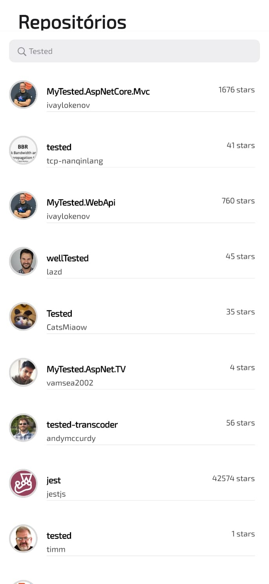

# GitHub Finder

>Pesquisa de repositórios usando [GitHub - API](https://docs.github.com/pt/rest/search?apiVersion=2022-11-28#search-repositories) e exibe o repositório selecionado em uma WebView.

